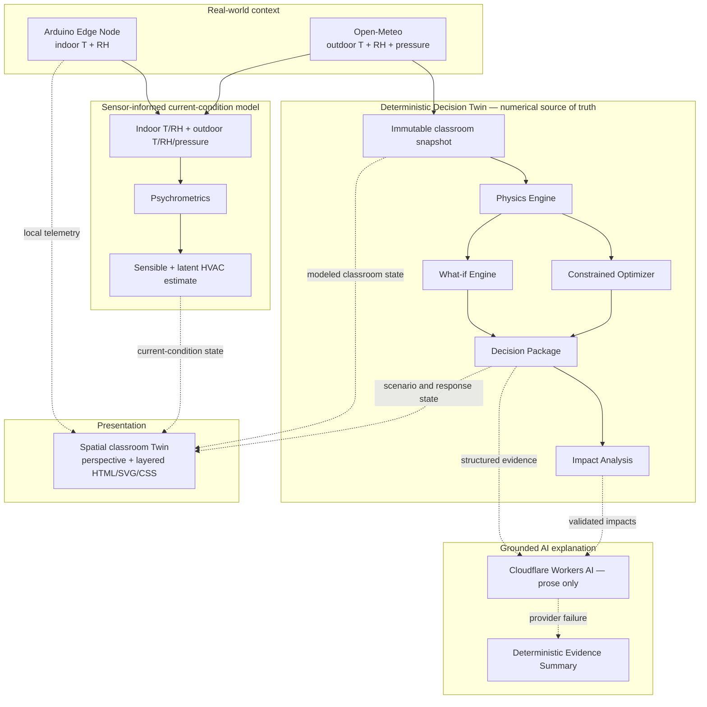

# EcoTwin

**AI-powered Energy Decision Digital Twin for physical spaces, starting with classrooms.**

> Simulate before you change.

EcoTwin connects real-world environmental context to a living classroom model, simulates possible futures, finds practical efficiency actions, quantifies their impact, and explains the evidence in clear language.

[Live Demo](https://ecotwin-ncwzid.vercel.app) · [GitHub Repository](https://github.com/jerrymiao0610-blip/EcoTwin) · [Edge Node Setup](hardware/arduino/README.md)

## The Problem

Building-energy decisions are often reactive. Operators can change a thermostat, lighting level, or equipment policy, but they cannot safely see the combined energy, emissions, cost, and comfort consequences before those changes affect the physical space.

EcoTwin provides a transparent decision layer between observation and action.

## What EcoTwin Does

EcoTwin follows one end-to-end decision loop:

**Physical world → edge node and real-world context → Digital Twin → simulate → optimize → recommend → impact → grounded AI explanation**

Users can configure a classroom, load Shanghai reference weather, connect real indoor telemetry, explore a what-if event, and compare three clearly named states:

1. **Current** — the present modeled classroom.
2. **What-if** — the scenario without an EcoTwin response.
3. **EcoTwin Response** — the constrained, simulated response recommended for that scenario.

## Why It Is a Digital Twin

EcoTwin is more than a dashboard or calculator. It maintains an explicit link between:

**physical state → modeled state → simulated future → decision → modeled impact**

The classroom twin combines its definition, operating state, and environmental context in an immutable snapshot. The Arduino-based EcoTwin Edge Node supplies measured indoor temperature and relative humidity when sensor mode is activated; Open-Meteo supplies outdoor context. EcoTwin then uses the same deterministic decision pipeline to test changes without changing the real classroom first.

The Living Classroom Digital Twin uses perspective and layered depth while keeping telemetry crisp and readable. State-driven HVAC airflow, environmental lighting, occupancy, device activity, and real Edge Node telemetry represent the modeled physical space. Current and what-if views stay inside the same classroom, with each visual update following deterministic model state.

## Core Capabilities

- **Living classroom Digital Twin** — presents classroom geometry, occupancy, schedules, controls, equipment, environmental context, and snapshot provenance in a spatial, perspective-based scene.
- **Deterministic energy simulation** — models bidirectional heating and cooling, lighting, device loads, occupant sensible heat, operating schedules, electricity, CO₂, and electricity cost.
- **What-if scenarios** — includes **Heatwave Tomorrow**, **Empty Classroom**, and **Eco Mode** with explicit parameter changes and comparison evidence.
- **Constrained optimizer** — searches thermostat, lighting, and device-allowance settings inside visible classroom-service limits. The default search keeps the thermostat at 20–26 °C, lighting at 60–100%, and device allowance at 40–100 W per occupant; it cannot “win” by turning everything off.
- **Current → What-if → EcoTwin Response comparison** — separates the untreated scenario from the response so savings always have a clear comparison basis.
- **Impact analysis** — reports modeled energy saved, emissions avoided, cost saved, percentage change, and component contribution from HVAC, lighting, and devices.
- **Grounded explanation** — production uses Cloudflare Workers AI to explain structured EcoTwin evidence. Numerical results remain deterministic source data, provider output is validated, and unavailable or invalid provider responses fall back to deterministic summaries.
- **Environmental context** — Open-Meteo can provide outdoor temperature, relative humidity, and surface pressure for the Shanghai reference location. A failed request falls back explicitly to the active manual outdoor temperature.
- **Sensor-informed mode** — combines measured indoor temperature and RH with outdoor context, target temperature, target RH, and a transparent psychrometric HVAC estimate.

> **The numbers come from EcoTwin. AI explains them.**

## EcoTwin Edge Node

The physically tested production hardware workflow is:

```text
Physical Classroom
        ↓
      DHT11
        ↓
Arduino UNO-class board
        ├──→ I2C OLED
        └──→ USB Serial (115200 baud)
                    ↓
           Browser Web Serial
                    ↓
                 EcoTwin
```

The reference node uses a DHT11 with its DATA line on digital pin **D7**, a 128×64 I2C OLED at primary address **`0x3C`** with **`0x3D`** compatibility fallback, and newline-delimited JSON over USB Serial:

```json
{"type":"ecotwin-edge","temperatureC":25.8,"humidityPercent":44.0}
```

Telemetry stays in the local browser connection. Arduino temperature and humidity are indoor observations: they do **not** silently replace the separate outdoor weather context. Sensor-informed calculation begins only after the user explicitly activates it.

For wiring, libraries, firmware upload, OLED behavior, and failure recovery, see [hardware/arduino/README.md](hardware/arduino/README.md).

## Sensor-Informed Environmental Model

Sensor mode builds a current-condition environmental snapshot from three sources:

| Role | Inputs |
| --- | --- |
| Indoor observation | Arduino temperature + relative humidity |
| Outdoor context | Open-Meteo temperature + relative humidity + surface pressure, or explicit manual fallback |
| Target state | Thermostat temperature + 50% relative humidity |

At a high level:

**psychrometrics → sensible heating/cooling load → latent/dehumidification load → modeled moisture removal → HVAC electrical estimate**

The daily result is a **sensor-informed modeled estimate** for the captured indoor state and current outdoor conditions. It is not measured electricity consumption. Monthly and yearly values are illustrative same-condition extrapolations; they repeat the same weather and initial indoor-state recovery for each operating day, so they are not weather-normalized forecasts.

This humidity-aware path is a separate current-condition model; EcoTwin does not present it as humidity integration across the what-if scenario and optimizer paths.

The principal constants are documented in [Modeling Assumptions](#modeling-assumptions).

## Architecture



The application is written with Next.js, React, TypeScript, and Tailwind CSS. Deterministic simulation, optimization, scenario, impact, decision, and presentation contracts are isolated from provider adapters. Open-Meteo provides weather context; Cloudflare Workers AI provides production explanation prose; Arduino and Web Serial provide the optional physical sensing layer. Vitest covers the analytical and integration behavior, and Vercel hosts the production application.

The spatial classroom Twin is a lightweight presentation layer built with CSS perspective, CSS 3D transforms, layered HTML/SVG/CSS scene geometry, and restrained pointer parallax. It keeps telemetry in a crisp overlay, includes responsive and reduced-motion fallbacks, and visualizes model outputs without recalculating them.

## Modeling Assumptions

These are visible **educational modeling assumptions**, not calibrated facts about a specific building and not building-code requirements.

### Core classroom simulation

- Envelope thermal coefficient: **12 W/(m²·K)**
- Occupant sensible heat: **75 W/person**
- HVAC coefficient of performance (COP): **3**
- Default electricity price used by the demo: **$0.15/kWh**
- Default grid carbon intensity used by the demo: **0.45 kg CO₂/kWh**
- Cost and carbon factors are configurable model inputs.

### Sensor-informed HVAC model

- Ventilation: **5 L/s-person + 0.6 L/s-m²**
- Infiltration: **0.3 air changes per hour**
- Ceiling height: **3 m**
- Target relative humidity: **50%**
- Occupant moisture generation: **0.06 kg/person-hour**
- Latent heat of vaporization: **2,450 kJ/kg**
- Effective thermal capacitance: **165 kJ/(m²·K)**
- Envelope transmission: **12 W/(m²·K)**
- Heating and cooling COP: **3**

The humidity-aware estimate keeps envelope transmission, outdoor-air sensible load, occupant heat, initial indoor-state recovery, ventilation moisture, infiltration moisture, occupant moisture, and latent removal explicit. It does not model active humidification.

## Trust and AI Grounding

Simulation, optimization, recommendations, savings, and component impacts are deterministic. AI does not calculate or replace energy values.

The explanation provider receives a detached, structured evidence package. EcoTwin validates returned sections and trusted fields, prevents provider-authored prose from introducing numerical claims, and uses a deterministic evidence summary if the provider is missing, fails, or returns invalid output. The architecture remains provider-neutral; the production provider is **Cloudflare Workers AI**.

> **The numbers come from EcoTwin. AI explains them.**

## Reliability

EcoTwin includes:

- typed input validation and bounded classroom controls;
- deterministic AI fallback and provider-result validation;
- explicit weather fallback instead of pretending fallback data is live;
- serial protocol validation, unsupported-browser messaging, disconnect recovery, and sensor failure handling;
- stale-telemetry detection so old measurements are not presented as current;
- responsive layouts, keyboard-accessible controls, visible focus states, and reduced-motion support;
- automated unit, integration, release-flow, API-route, and server-rendered component tests.

The current release passes **245 automated tests across 35 test files**; see [Testing](#testing) for the exact verification commands.

## Running Locally

Requirements: a current Node.js/npm environment. The core application and deterministic explanation fallback work without provider credentials.

```bash
npm install
npm run dev
```

Open [http://localhost:3000](http://localhost:3000).

To enable the production explanation provider locally, copy `.env.example` to `.env.local` and configure these server-only variable names:

- `CLOUDFLARE_ACCOUNT_ID`
- `CLOUDFLARE_API_TOKEN`
- `CLOUDFLARE_AI_MODEL` — optional model override

Never expose provider credentials through a `NEXT_PUBLIC_` variable. Open-Meteo requires no API key in this project.

## Hardware Setup

Use the complete [EcoTwin Edge Node setup guide](hardware/arduino/README.md). In brief:

1. Connect a DHT11 DATA line to Arduino **D7**.
2. Connect the I2C OLED; the firmware probes **`0x3C`** first and **`0x3D`** second.
3. Install the documented Adafruit libraries, then verify and upload the firmware.
4. Confirm newline-delimited telemetry at **115200 baud**.
5. Close Arduino Serial Monitor before connecting through EcoTwin in desktop Chrome or Edge; only one application can normally own the serial port at a time.

## Browser Support

The normal EcoTwin software experience uses standard web APIs and works in modern browsers. The Edge Node connection depends on Web Serial and therefore requires a supported desktop Chromium browser such as **Chrome or Edge**. Unsupported browsers receive an explicit message and can still use the software-only Digital Twin.

## Testing

Run the same checks used for the hackathon release:

```bash
npm test
npm run lint
npx tsc --noEmit
npm run build -- --webpack
git diff --check
```

## Limitations

- EcoTwin is an educational energy decision-support model, not a utility meter and not certified building-energy software.
- Its energy, emissions, cost, savings, and moisture-removal values are modeled estimates, not measurements of electricity consumption or verified building performance.
- The thermal model does not include detailed solar gain, window, duct, coil, fan, equipment-curve, or control-system dynamics.
- DHT11 placement and calibration have not been independently verified; sensor quality and placement affect the indoor observation.
- A daily sensor-mode result is a current-condition scenario. Monthly and yearly sensor values are illustrative same-condition extrapolations, not weather-normalized forecasts.
- The current implemented and tested demo scale is a classroom. Building, campus, and portfolio operation remain future extensions.

## What's Next

The product direction is:

**Classroom → Building → Campus → Portfolio**

Potential future work includes higher-fidelity hourly simulation, calibrated energy-meter integration, occupancy sensing, additional environmental sensors, building-management-system integration, carbon-intensity optimization, and uncertainty or confidence modeling. These are future possibilities, not current product claims.

## Hackathon

EcoTwin was created for **NextStep Hacks 2026 / Earth Forward** to demonstrate a practical, explainable way to test energy decisions before applying them to a physical space.

---

EcoTwin is not merely an energy dashboard, an energy calculator, or an Arduino sensor project. It is an end-to-end Energy Decision Digital Twin built around one principle: **simulate before you change**.
